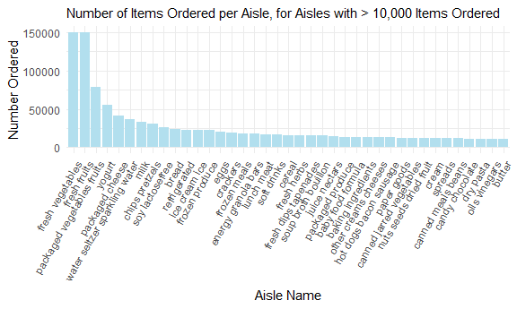
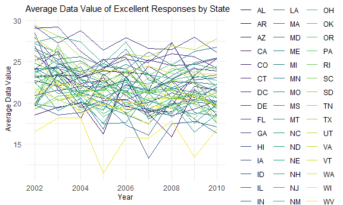
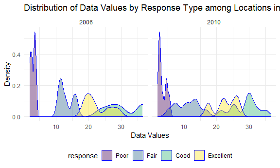
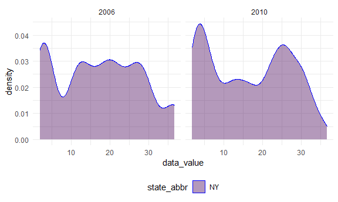

p8105\_hw3\_acm2268
================
Amanda Miles
10/16/2021

\#Question 1

\#\#Reading in data

``` r
library(p8105.datasets)
data("instacart")
```

\#\#Initial Data Exploration

``` r
skimr::skim(instacart)
```

|                                                  |           |
|:-------------------------------------------------|:----------|
| Name                                             | instacart |
| Number of rows                                   | 1384617   |
| Number of columns                                | 15        |
| \_\_\_\_\_\_\_\_\_\_\_\_\_\_\_\_\_\_\_\_\_\_\_   |           |
| Column type frequency:                           |           |
| character                                        | 4         |
| numeric                                          | 11        |
| \_\_\_\_\_\_\_\_\_\_\_\_\_\_\_\_\_\_\_\_\_\_\_\_ |           |
| Group variables                                  | None      |

Data summary

**Variable type: character**

| skim\_variable | n\_missing | complete\_rate | min | max | empty | n\_unique | whitespace |
|:---------------|-----------:|---------------:|----:|----:|------:|----------:|-----------:|
| eval\_set      |          0 |              1 |   5 |   5 |     0 |         1 |          0 |
| product\_name  |          0 |              1 |   3 | 159 |     0 |     39123 |          0 |
| aisle          |          0 |              1 |   3 |  29 |     0 |       134 |          0 |
| department     |          0 |              1 |   4 |  15 |     0 |        21 |          0 |

**Variable type: numeric**

| skim\_variable            | n\_missing | complete\_rate |       mean |        sd |  p0 |    p25 |     p50 |     p75 |    p100 | hist  |
|:--------------------------|-----------:|---------------:|-----------:|----------:|----:|-------:|--------:|--------:|--------:|:------|
| order\_id                 |          0 |              1 | 1706297.62 | 989732.65 |   1 | 843370 | 1701880 | 2568023 | 3421070 | ▇▇▇▇▇ |
| product\_id               |          0 |              1 |   25556.24 |  14121.27 |   1 |  13380 |   25298 |   37940 |   49688 | ▆▆▇▆▇ |
| add\_to\_cart\_order      |          0 |              1 |       8.76 |      7.42 |   1 |      3 |       7 |      12 |      80 | ▇▁▁▁▁ |
| reordered                 |          0 |              1 |       0.60 |      0.49 |   0 |      0 |       1 |       1 |       1 | ▆▁▁▁▇ |
| user\_id                  |          0 |              1 |  103112.78 |  59487.15 |   1 |  51732 |  102933 |  154959 |  206209 | ▇▇▇▇▇ |
| order\_number             |          0 |              1 |      17.09 |     16.61 |   4 |      6 |      11 |      21 |     100 | ▇▂▁▁▁ |
| order\_dow                |          0 |              1 |       2.70 |      2.17 |   0 |      1 |       3 |       5 |       6 | ▇▂▂▂▆ |
| order\_hour\_of\_day      |          0 |              1 |      13.58 |      4.24 |   0 |     10 |      14 |      17 |      23 | ▁▃▇▇▃ |
| days\_since\_prior\_order |          0 |              1 |      17.07 |     10.43 |   0 |      7 |      15 |      30 |      30 | ▅▅▃▂▇ |
| aisle\_id                 |          0 |              1 |      71.30 |     38.10 |   1 |     31 |      83 |     107 |     134 | ▆▃▃▇▆ |
| department\_id            |          0 |              1 |       9.84 |      6.29 |   1 |      4 |       8 |      16 |      21 | ▇▂▂▅▂ |

``` r
str(instacart)
```

    ## tibble [1,384,617 x 15] (S3: tbl_df/tbl/data.frame)
    ##  $ order_id              : int [1:1384617] 1 1 1 1 1 1 1 1 36 36 ...
    ##  $ product_id            : int [1:1384617] 49302 11109 10246 49683 43633 13176 47209 22035 39612 19660 ...
    ##  $ add_to_cart_order     : int [1:1384617] 1 2 3 4 5 6 7 8 1 2 ...
    ##  $ reordered             : int [1:1384617] 1 1 0 0 1 0 0 1 0 1 ...
    ##  $ user_id               : int [1:1384617] 112108 112108 112108 112108 112108 112108 112108 112108 79431 79431 ...
    ##  $ eval_set              : chr [1:1384617] "train" "train" "train" "train" ...
    ##  $ order_number          : int [1:1384617] 4 4 4 4 4 4 4 4 23 23 ...
    ##  $ order_dow             : int [1:1384617] 4 4 4 4 4 4 4 4 6 6 ...
    ##  $ order_hour_of_day     : int [1:1384617] 10 10 10 10 10 10 10 10 18 18 ...
    ##  $ days_since_prior_order: int [1:1384617] 9 9 9 9 9 9 9 9 30 30 ...
    ##  $ product_name          : chr [1:1384617] "Bulgarian Yogurt" "Organic 4% Milk Fat Whole Milk Cottage Cheese" "Organic Celery Hearts" "Cucumber Kirby" ...
    ##  $ aisle_id              : int [1:1384617] 120 108 83 83 95 24 24 21 2 115 ...
    ##  $ department_id         : int [1:1384617] 16 16 4 4 15 4 4 16 16 7 ...
    ##  $ aisle                 : chr [1:1384617] "yogurt" "other creams cheeses" "fresh vegetables" "fresh vegetables" ...
    ##  $ department            : chr [1:1384617] "dairy eggs" "dairy eggs" "produce" "produce" ...
    ##  - attr(*, "spec")=
    ##   .. cols(
    ##   ..   order_id = col_integer(),
    ##   ..   product_id = col_integer(),
    ##   ..   add_to_cart_order = col_integer(),
    ##   ..   reordered = col_integer(),
    ##   ..   user_id = col_integer(),
    ##   ..   eval_set = col_character(),
    ##   ..   order_number = col_integer(),
    ##   ..   order_dow = col_integer(),
    ##   ..   order_hour_of_day = col_integer(),
    ##   ..   days_since_prior_order = col_integer(),
    ##   ..   product_name = col_character(),
    ##   ..   aisle_id = col_integer(),
    ##   ..   department_id = col_integer(),
    ##   ..   aisle = col_character(),
    ##   ..   department = col_character()
    ##   .. )

This dataset is the Instacart Online Grocery Shopping Dataset from 2017
and the file is loaded from p8105.datasets. There are 1384617 rows of
data and 15 variables in the dataset. The specific variables included
are order\_id, product\_id, add\_to\_cart\_order, reordered, user\_id,
eval\_set, order\_number, order\_dow, order\_hour\_of\_day,
days\_since\_prior\_order, product\_name, aisle\_id, department\_id,
aisle, department.

There are 134 aisles and the most items are ordered from aisles 83, 24,
123.

\#\#Plotting the number of items ordered per aisle among aisles with
&gt; 10,000 items ordered

``` r
n_items_df = instacart %>% 
  group_by(aisle, department) %>%
  summarise(n = n())
```

    ## `summarise()` has grouped output by 'aisle'. You can override using the `.groups` argument.

``` r
filter(n_items_df, n > 10000) %>%
print()
```

    ## # A tibble: 39 x 3
    ## # Groups:   aisle [39]
    ##    aisle                    department       n
    ##    <chr>                    <chr>        <int>
    ##  1 baby food formula        babies       13198
    ##  2 baking ingredients       pantry       13088
    ##  3 bread                    bakery       23635
    ##  4 butter                   dairy eggs   10575
    ##  5 candy chocolate          snacks       11453
    ##  6 canned jarred vegetables canned goods 12679
    ##  7 canned meals beans       canned goods 11774
    ##  8 cereal                   breakfast    16201
    ##  9 chips pretzels           snacks       31269
    ## 10 crackers                 snacks       19592
    ## # ... with 29 more rows

``` r
ggplot(n_items_df, aes(x = aisle, y = n, color = department)) + 
  geom_point(alpha = .5) +
  facet_grid(. ~ department)
```



\#\#Creating Table with the 3 Most Popular Items Ordered from the Baking
Ingredients, Dog Food Care, and Packaged Vegetables Aisles

``` r
instacart %>%
  filter(aisle %in% c("baking ingredients", "dog food care", "packaged vegetables fruits")) %>%
  select(aisle, product_name) %>%
  group_by(product_name) %>%
  mutate(
    n_ordered = n(),
    n_rank = min_rank(desc(n_ordered)))
```

    ## # A tibble: 93,193 x 4
    ## # Groups:   product_name [1,444]
    ##    aisle                      product_name                      n_ordered n_rank
    ##    <chr>                      <chr>                                 <int>  <int>
    ##  1 packaged vegetables fruits Super Greens Salad                      644      1
    ##  2 packaged vegetables fruits Organic Biologique Limes                101      1
    ##  3 packaged vegetables fruits Organic Baby Arugula                   2923      1
    ##  4 packaged vegetables fruits Organic Grape Tomatoes                 3823      1
    ##  5 packaged vegetables fruits Organic Raspberries                    5546      1
    ##  6 packaged vegetables fruits Organic Blueberries                    4966      1
    ##  7 packaged vegetables fruits Organic Raspberries                    5546      1
    ##  8 baking ingredients         100% Organic Unbleached All-Purp~        21      1
    ##  9 baking ingredients         Organic Corn Starch                      21      1
    ## 10 packaged vegetables fruits I Heart Baby Kale                       475      1
    ## # ... with 93,183 more rows

\#\#Table: Mean hour at which Pink Lady Apples and Coffee Ice Cream are
ordered each day of the week

``` r
instacart %>% 
  mutate(
    order_dow = recode(order_dow, `0` = "Monday", `1` = "Tuesday", `2` = "Wednesday", `3` = "Thursday", `4` = "Friday", `5` = "Saturday", `6` = "Sunday")) %>%
  select(product_name, order_dow, order_hour_of_day) %>% 
  filter(product_name %in% c("Pink Lady Apples", "Coffee Ice Cream")) %>%
  group_by(product_name, order_dow) %>%
  summarize(
    mean_hour = mean(order_hour_of_day)) %>%
  pivot_wider(names_from = order_dow, values_from = mean_hour)
```

    ## `summarise()` has grouped output by 'product_name'. You can override using the `.groups` argument.

    ## # A tibble: 2 x 8
    ## # Groups:   product_name [2]
    ##   product_name     Friday Monday Saturday Sunday Thursday Tuesday Wednesday
    ##   <chr>             <dbl>  <dbl>    <dbl>  <dbl>    <dbl>   <dbl>     <dbl>
    ## 1 Coffee Ice Cream   15.2   13.8     12.3   13.8     15.3    14.3      15.4
    ## 2 Pink Lady Apples   11.6   13.4     12.8   11.9     14.2    11.4      11.7

\#Question 2: BRFSS

\#\#Load BRFSS data

``` r
library(p8105.datasets)
data("brfss_smart2010") 
```

\#\#Understand BRFSS data

``` r
skimr::skim(brfss_smart2010)
```

|                                                  |                  |
|:-------------------------------------------------|:-----------------|
| Name                                             | brfss\_smart2010 |
| Number of rows                                   | 134203           |
| Number of columns                                | 23               |
| \_\_\_\_\_\_\_\_\_\_\_\_\_\_\_\_\_\_\_\_\_\_\_   |                  |
| Column type frequency:                           |                  |
| character                                        | 17               |
| numeric                                          | 6                |
| \_\_\_\_\_\_\_\_\_\_\_\_\_\_\_\_\_\_\_\_\_\_\_\_ |                  |
| Group variables                                  | None             |

Data summary

**Variable type: character**

| skim\_variable                | n\_missing | complete\_rate | min | max | empty | n\_unique | whitespace |
|:------------------------------|-----------:|---------------:|----:|----:|------:|----------:|-----------:|
| Locationabbr                  |          0 |           1.00 |   2 |   2 |     0 |        51 |          0 |
| Locationdesc                  |          0 |           1.00 |  15 |  33 |     0 |       404 |          0 |
| Class                         |          0 |           1.00 |  11 |  28 |     0 |        16 |          0 |
| Topic                         |          0 |           1.00 |   6 |  22 |     0 |        31 |          0 |
| Question                      |          0 |           1.00 |  27 | 172 |     0 |        40 |          0 |
| Response                      |          0 |           1.00 |   2 |  42 |     0 |        23 |          0 |
| Data\_value\_unit             |          0 |           1.00 |   1 |   1 |     0 |         1 |          0 |
| Data\_value\_type             |          0 |           1.00 |  16 |  16 |     0 |         1 |          0 |
| Data\_Value\_Footnote\_Symbol |     129688 |           0.03 |   1 |   1 |     0 |         1 |          0 |
| Data\_Value\_Footnote         |     129688 |           0.03 | 197 | 197 |     0 |         1 |          0 |
| DataSource                    |          0 |           1.00 |   5 |   5 |     0 |         1 |          0 |
| ClassId                       |          0 |           1.00 |   7 |   7 |     0 |        16 |          0 |
| TopicId                       |          0 |           1.00 |   7 |   7 |     0 |        31 |          0 |
| LocationID                    |     134203 |           0.00 |  NA |  NA |     0 |         0 |          0 |
| QuestionID                    |          0 |           1.00 |   7 |   8 |     0 |        59 |          0 |
| RESPID                        |          0 |           1.00 |   7 |   7 |     0 |        23 |          0 |
| GeoLocation                   |          0 |           1.00 |  20 |  24 |     0 |       404 |          0 |

**Variable type: numeric**

| skim\_variable          | n\_missing | complete\_rate |    mean |     sd |     p0 |    p25 |    p50 |     p75 |   p100 | hist  |
|:------------------------|-----------:|---------------:|--------:|-------:|-------:|-------:|-------:|--------:|-------:|:------|
| Year                    |          0 |           1.00 | 2006.77 |   2.39 | 2002.0 | 2005.0 | 2007.0 | 2009.00 | 2010.0 | ▃▅▃▇▇ |
| Sample\_Size            |          2 |           1.00 |  271.73 | 357.89 |    1.0 |   59.0 |  153.0 |  353.00 | 4505.0 | ▇▁▁▁▁ |
| Data\_value             |       4515 |           0.97 |   43.23 |  32.40 |    0.1 |   14.3 |   33.2 |   77.30 |   99.9 | ▇▅▂▃▅ |
| Confidence\_limit\_Low  |          0 |           1.00 |   37.74 |  32.42 |    0.0 |    8.5 |   25.9 |   71.10 |   99.7 | ▇▃▂▃▃ |
| Confidence\_limit\_High |          0 |           1.00 |   45.76 |  33.29 |    0.0 |   16.3 |   37.0 |   81.55 |  100.0 | ▇▆▃▃▇ |
| Display\_order          |          0 |           1.00 |   32.40 |  18.73 |    1.0 |   16.0 |   32.0 |   48.00 |   68.0 | ▇▇▇▇▆ |

``` r
str(brfss_smart2010)
```

    ## tibble [134,203 x 23] (S3: tbl_df/tbl/data.frame)
    ##  $ Year                      : int [1:134203] 2010 2010 2010 2010 2010 2010 2010 2010 2010 2010 ...
    ##  $ Locationabbr              : chr [1:134203] "AL" "AL" "AL" "AL" ...
    ##  $ Locationdesc              : chr [1:134203] "AL - Jefferson County" "AL - Jefferson County" "AL - Jefferson County" "AL - Jefferson County" ...
    ##  $ Class                     : chr [1:134203] "Health Status" "Health Status" "Health Status" "Health Status" ...
    ##  $ Topic                     : chr [1:134203] "Overall Health" "Overall Health" "Overall Health" "Overall Health" ...
    ##  $ Question                  : chr [1:134203] "How is your general health?" "How is your general health?" "How is your general health?" "How is your general health?" ...
    ##  $ Response                  : chr [1:134203] "Excellent" "Very good" "Good" "Fair" ...
    ##  $ Sample_Size               : int [1:134203] 94 148 208 107 45 450 152 524 77 316 ...
    ##  $ Data_value                : num [1:134203] 18.9 30 33.1 12.5 5.5 82 18 79.3 20.7 74.9 ...
    ##  $ Confidence_limit_Low      : num [1:134203] 14.1 24.9 28.2 9.5 3.5 78.6 14.6 74 15.4 68.6 ...
    ##  $ Confidence_limit_High     : num [1:134203] 23.6 35 38 15.4 7.4 85.3 21.3 84.5 25.9 81.1 ...
    ##  $ Display_order             : int [1:134203] 1 2 3 4 5 6 7 8 9 10 ...
    ##  $ Data_value_unit           : chr [1:134203] "%" "%" "%" "%" ...
    ##  $ Data_value_type           : chr [1:134203] "Crude Prevalence" "Crude Prevalence" "Crude Prevalence" "Crude Prevalence" ...
    ##  $ Data_Value_Footnote_Symbol: chr [1:134203] NA NA NA NA ...
    ##  $ Data_Value_Footnote       : chr [1:134203] NA NA NA NA ...
    ##  $ DataSource                : chr [1:134203] "BRFSS" "BRFSS" "BRFSS" "BRFSS" ...
    ##  $ ClassId                   : chr [1:134203] "CLASS08" "CLASS08" "CLASS08" "CLASS08" ...
    ##  $ TopicId                   : chr [1:134203] "Topic41" "Topic41" "Topic41" "Topic41" ...
    ##  $ LocationID                : chr [1:134203] NA NA NA NA ...
    ##  $ QuestionID                : chr [1:134203] "GENHLTH" "GENHLTH" "GENHLTH" "GENHLTH" ...
    ##  $ RESPID                    : chr [1:134203] "RESP056" "RESP057" "RESP058" "RESP059" ...
    ##  $ GeoLocation               : chr [1:134203] "(33.518601, -86.814688)" "(33.518601, -86.814688)" "(33.518601, -86.814688)" "(33.518601, -86.814688)" ...
    ##  - attr(*, "spec")=
    ##   .. cols(
    ##   ..   Year = col_integer(),
    ##   ..   Locationabbr = col_character(),
    ##   ..   Locationdesc = col_character(),
    ##   ..   Class = col_character(),
    ##   ..   Topic = col_character(),
    ##   ..   Question = col_character(),
    ##   ..   Response = col_character(),
    ##   ..   Sample_Size = col_integer(),
    ##   ..   Data_value = col_double(),
    ##   ..   Confidence_limit_Low = col_double(),
    ##   ..   Confidence_limit_High = col_double(),
    ##   ..   Display_order = col_integer(),
    ##   ..   Data_value_unit = col_character(),
    ##   ..   Data_value_type = col_character(),
    ##   ..   Data_Value_Footnote_Symbol = col_character(),
    ##   ..   Data_Value_Footnote = col_character(),
    ##   ..   DataSource = col_character(),
    ##   ..   ClassId = col_character(),
    ##   ..   TopicId = col_character(),
    ##   ..   LocationID = col_character(),
    ##   ..   QuestionID = col_character(),
    ##   ..   RESPID = col_character(),
    ##   ..   GeoLocation = col_character()
    ##   .. )

\#\#Clean BRFSS data

``` r
brfss_df = select(brfss_smart2010, year = Year, state_abbr = Locationabbr, location_desc = Locationdesc, topic = Topic, response = Response, data_value = Data_value, data_type = Data_value_type, data_unit = Data_value_unit ) %>%
  filter(topic == "Overall Health" & response %in% c("Excellent", "Very Good", "Good", "Fair", "Poor")) %>%
  mutate(
    response = factor(response),
    response = forcats::fct_relevel(response, c("Poor", "Fair", "Good", "Very Good", "Excellent"))
  ) 
```

    ## Warning: Unknown levels in `f`: Very Good

\#\#BRFSS exploratory data analysis

\#\#\#Exploratory analysis of states and the number of locations
observed in 2002 and 2010

``` r
brfss_df %>%
 filter(year == 2002) %>%
  group_by(state_abbr) %>%
  summarize(n_locations = n_distinct(location_desc)) %>%
  filter(n_locations > 6)
```

    ## # A tibble: 6 x 2
    ##   state_abbr n_locations
    ##   <chr>            <int>
    ## 1 CT                   7
    ## 2 FL                   7
    ## 3 MA                   8
    ## 4 NC                   7
    ## 5 NJ                   8
    ## 6 PA                  10

``` r
brfss_df %>%
 filter(year == 2010) %>%
  group_by(state_abbr) %>%
  summarize(n_locations = n_distinct(location_desc)) %>%
  filter(n_locations > 6)
```

    ## # A tibble: 14 x 2
    ##    state_abbr n_locations
    ##    <chr>            <int>
    ##  1 CA                  12
    ##  2 CO                   7
    ##  3 FL                  41
    ##  4 MA                   9
    ##  5 MD                  12
    ##  6 NC                  12
    ##  7 NE                  10
    ##  8 NJ                  19
    ##  9 NY                   9
    ## 10 OH                   8
    ## 11 PA                   7
    ## 12 SC                   7
    ## 13 TX                  16
    ## 14 WA                  10

In 2002, the states Connecticut, Florida, Massachusetts, North Carolina,
New Jersey, and Pennsylvania were observed at 7 or more locations. In
2010, the states California, Colorado, Florida, Massachusetts, Maryland,
North Carolina, Nebraska, New Jersey, New York, Ohio, Pennsylvania,
South Carolina, Texas, and Washington were observed at 7 or more
locations.

\#\#\#Exploratory analysis of “excellent” responses

``` r
excellent_df = select(brfss_df, year, state_abbr, data_value, location_desc, response) %>%
  filter(response == "Excellent") %>%
  group_by(year, state_abbr) %>%
  mutate(avg_value = mean(data_value, na.rm = TRUE)) %>%
  select(-data_value) 

ggplot(data = excellent_df, aes(x = year, y = avg_value, color = state_abbr)) +
  geom_line(data = excellent_df) + theme(legend.position = "right")
```



\#\#\#Exploratory analysis of the distribution of data value responses
among locations in NY State FOR 2006 and 2010

``` r
ny_df = select(brfss_df, year, state_abbr, location_desc, response, data_value) %>%
  filter(year %in% c(2006, 2010) & state_abbr == "NY") %>%
  group_by(year, response)

ggplot(ny_df, aes(x = data_value, fill = response)) + 
  geom_density(alpha = .4, adjust = .5, color = "blue") +
  facet_grid(. ~ year)
```



``` r
ny_df %>% 
  ungroup(response)
```

    ## # A tibble: 60 x 5
    ## # Groups:   year [2]
    ##     year state_abbr location_desc     response  data_value
    ##    <int> <chr>      <chr>             <fct>          <dbl>
    ##  1  2010 NY         NY - Bronx County Excellent       17.6
    ##  2  2010 NY         NY - Bronx County Good            35.1
    ##  3  2010 NY         NY - Bronx County Fair            16.7
    ##  4  2010 NY         NY - Bronx County Poor             4.7
    ##  5  2010 NY         NY - Erie County  Excellent       17.2
    ##  6  2010 NY         NY - Erie County  Good            29.6
    ##  7  2010 NY         NY - Erie County  Fair            12.7
    ##  8  2010 NY         NY - Erie County  Poor             2.5
    ##  9  2010 NY         NY - Kings County Excellent       22.4
    ## 10  2010 NY         NY - Kings County Good            30.6
    ## # ... with 50 more rows

``` r
ggplot(ny_df, aes(x = data_value, fill = state_abbr)) + 
  geom_density(alpha = .4, adjust = .5, color = "blue") +
  facet_grid(. ~ year)
```



\#Question 3: Accelerometer

\#\#Load, clean, and tidy the accelerometer data

``` r
accel_df = read_csv(file = "./data/accel_data.csv") %>%
janitor::clean_names() %>%
  mutate(
    type_of_day = ifelse(day %in% c("Monday", "Tuesday", "Wednesday", "Thursday", "Friday"), "weekday", 
                         ifelse(day %in% c("Saturday", "Sunday"), "weekend", ""))
    ) %>%
  relocate(week, type_of_day)
```

    ## Rows: 35 Columns: 1443

    ## -- Column specification --------------------------------------------------------
    ## Delimiter: ","
    ## chr    (1): day
    ## dbl (1442): week, day_id, activity.1, activity.2, activity.3, activity.4, ac...

    ## 
    ## i Use `spec()` to retrieve the full column specification for this data.
    ## i Specify the column types or set `show_col_types = FALSE` to quiet this message.

``` r
str(accel_df)
```

    ## tibble [35 x 1,444] (S3: tbl_df/tbl/data.frame)
    ##  $ week         : num [1:35] 1 1 1 1 1 1 1 2 2 2 ...
    ##  $ type_of_day  : chr [1:35] "weekday" "weekday" "weekend" "weekend" ...
    ##  $ day_id       : num [1:35] 1 2 3 4 5 6 7 8 9 10 ...
    ##  $ day          : chr [1:35] "Friday" "Monday" "Saturday" "Sunday" ...
    ##  $ activity_1   : num [1:35] 88.4 1 1 1 47.4 ...
    ##  $ activity_2   : num [1:35] 82.2 1 1 1 48.8 ...
    ##  $ activity_3   : num [1:35] 64.4 1 1 1 46.9 ...
    ##  $ activity_4   : num [1:35] 70 1 1 1 35.8 ...
    ##  $ activity_5   : num [1:35] 75 1 1 1 49 ...
    ##  $ activity_6   : num [1:35] 66.3 1 1 1 44.8 ...
    ##  $ activity_7   : num [1:35] 53.8 1 1 1 73.4 ...
    ##  $ activity_8   : num [1:35] 47.8 1 1 1 24.3 ...
    ##  $ activity_9   : num [1:35] 55.5 1 1 1 34.5 ...
    ##  $ activity_10  : num [1:35] 43 1 1 1 72.8 ...
    ##  $ activity_11  : num [1:35] 46.8 1 1 1 40.4 ...
    ##  $ activity_12  : num [1:35] 25.5 1 1 1 56.1 ...
    ##  $ activity_13  : num [1:35] 19 1 1 32 50 ...
    ##  $ activity_14  : num [1:35] 31.1 1 1 1 35.3 ...
    ##  $ activity_15  : num [1:35] 22.9 1 1 1 35.5 ...
    ##  $ activity_16  : num [1:35] 24.8 1 1 1 59.7 ...
    ##  $ activity_17  : num [1:35] 51 1 1 32 28.3 ...
    ##  $ activity_18  : num [1:35] 35.5 1 1 1 32 ...
    ##  $ activity_19  : num [1:35] 41 1 1 85 48.8 ...
    ##  $ activity_20  : num [1:35] 59 1 1 116 31.7 ...
    ##  $ activity_21  : num [1:35] 25.2 1 1 1 21 ...
    ##  $ activity_22  : num [1:35] 19.4 1 1 1 17.8 ...
    ##  $ activity_23  : num [1:35] 44.7 1 1 1 32.6 ...
    ##  $ activity_24  : num [1:35] 17.1 1 1 1 18.1 ...
    ##  $ activity_25  : num [1:35] 43.9 1 1 1 61.2 ...
    ##  $ activity_26  : num [1:35] 47.5 1 1 1 56.6 ...
    ##  $ activity_27  : num [1:35] 46.1 1 1 11 55.2 ...
    ##  $ activity_28  : num [1:35] 34.6 1 1 1 92.1 ...
    ##  $ activity_29  : num [1:35] 40.3 1 1 150 31.3 ...
    ##  $ activity_30  : num [1:35] 46.5 1 1 1 45.5 ...
    ##  $ activity_31  : num [1:35] 53.2 1 379 11 37.9 ...
    ##  $ activity_32  : num [1:35] 23.8 1 696 1 22.2 ...
    ##  $ activity_33  : num [1:35] 35.3 1 759 1 18.2 ...
    ##  $ activity_34  : num [1:35] 30.7 1 1168 64 26 ...
    ##  $ activity_35  : num [1:35] 40.1 1 150 276 19.5 ...
    ##  $ activity_36  : num [1:35] 25.3 1 53 1 8.2 ...
    ##  $ activity_37  : num [1:35] 8.89 1 95 1 16.6 ...
    ##  $ activity_38  : num [1:35] 14.7 1 150 1 18.1 ...
    ##  $ activity_39  : num [1:35] 18.5 1 32 1 39.6 ...
    ##  $ activity_40  : num [1:35] 40.7 1 74 1 21.2 ...
    ##  $ activity_41  : num [1:35] 20 1 137 1 30.4 ...
    ##  $ activity_42  : num [1:35] 37.1 1 305 1 38.3 ...
    ##  $ activity_43  : num [1:35] 22.6 1 305 1 53 ...
    ##  $ activity_44  : num [1:35] 22.8 1 43 1 37.2 ...
    ##  $ activity_45  : num [1:35] 16.1 1 85 163 45.8 ...
    ##  $ activity_46  : num [1:35] 29.8 1 64 1 22.4 ...
    ##  $ activity_47  : num [1:35] 39.4 1 1 1 20.6 ...
    ##  $ activity_48  : num [1:35] 29.7 1 1 1 37.3 ...
    ##  $ activity_49  : num [1:35] 54.8 1 1 95 42.3 ...
    ##  $ activity_50  : num [1:35] 48.3 1 1 1 44 ...
    ##  $ activity_51  : num [1:35] 66.1 1 1 1 41.8 ...
    ##  $ activity_52  : num [1:35] 65.2 1 1 1 58.3 ...
    ##  $ activity_53  : num [1:35] 35.7 1 1 1 63.8 ...
    ##  $ activity_54  : num [1:35] 31.7 1 1 1 31.7 ...
    ##  $ activity_55  : num [1:35] 26 1 1 1 24.6 ...
    ##  $ activity_56  : num [1:35] 36.6 1 1 1 29.1 ...
    ##  $ activity_57  : num [1:35] 25.2 1 1 1 19 ...
    ##  $ activity_58  : num [1:35] 27.9 1 1 1 54.6 ...
    ##  $ activity_59  : num [1:35] 58 1 1 1 35.9 ...
    ##  $ activity_60  : num [1:35] 44.2 1 1 1 34.1 ...
    ##  $ activity_61  : num [1:35] 46.8 1 1 1 40 ...
    ##  $ activity_62  : num [1:35] 41.7 1 1 1 25.2 ...
    ##  $ activity_63  : num [1:35] 57 1 1 1 35 ...
    ##  $ activity_64  : num [1:35] 51.2 1 1 1 41.6 ...
    ##  $ activity_65  : num [1:35] 63.5 1 1 1 23.9 ...
    ##  $ activity_66  : num [1:35] 45.4 1 11 1 19.3 ...
    ##  $ activity_67  : num [1:35] 44.89 1 1 1 8.64 ...
    ##  $ activity_68  : num [1:35] 21.7 1 11 1 12.9 ...
    ##  $ activity_69  : num [1:35] 11.6 1 1 1 11.7 ...
    ##  $ activity_70  : num [1:35] 37.4 1 1 1 15 ...
    ##  $ activity_71  : num [1:35] 36.1 1 1 1 22.7 ...
    ##  $ activity_72  : num [1:35] 25.8 1 1 1 50.5 ...
    ##  $ activity_73  : num [1:35] 15.1 1 1 1 19.6 ...
    ##  $ activity_74  : num [1:35] 38.5 1 1 1 18.5 ...
    ##  $ activity_75  : num [1:35] 46.7 1 1 1 34.1 ...
    ##  $ activity_76  : num [1:35] 50.1 1 1 11 27.3 ...
    ##  $ activity_77  : num [1:35] 52.5 1 1 43 33.8 ...
    ##  $ activity_78  : num [1:35] 67.9 1 1 1 10.3 ...
    ##  $ activity_79  : num [1:35] 71.4 1 1 1 11.2 ...
    ##  $ activity_80  : num [1:35] 61.1 1 1 1 8.2 ...
    ##  $ activity_81  : num [1:35] 35.4 1 1 74 27.6 ...
    ##  $ activity_82  : num [1:35] 41.5 1 1 1 10.6 ...
    ##  $ activity_83  : num [1:35] 46.6 1 1 74 28 ...
    ##  $ activity_84  : num [1:35] 38.3 1 1 85 30.7 ...
    ##  $ activity_85  : num [1:35] 23.4 1 1 1 57.1 ...
    ##  $ activity_86  : num [1:35] 68.7 1 1 1 29.9 ...
    ##  $ activity_87  : num [1:35] 44 1 1 1 41.9 ...
    ##  $ activity_88  : num [1:35] 33.82 1 1 1 7.71 ...
    ##  $ activity_89  : num [1:35] 21.3 1 1 1 19.4 ...
    ##  $ activity_90  : num [1:35] 37.1 1 1 1 19.2 ...
    ##  $ activity_91  : num [1:35] 46.8 1 1 1 7.8 ...
    ##  $ activity_92  : num [1:35] 46.87 1 1 1 4.71 ...
    ##  $ activity_93  : num [1:35] 39.78 1 1 1 7.27 ...
    ##  $ activity_94  : num [1:35] 26.8 1 1 1 15.3 ...
    ##  $ activity_95  : num [1:35] 22.7 1 1 1 25.9 ...
    ##   [list output truncated]

\#\#Aggregate across minutes to create a total activity variable

``` r
accel_df %>% 
mutate(
  total_activity = round(rowSums(select(., starts_with("activity")), na.rm = FALSE)), digit = 2) %>%
  relocate(week, type_of_day, day_id, day, total_activity)
```

    ## # A tibble: 35 x 1,446
    ##     week type_of_day day_id day       total_activity activity_1 activity_2
    ##    <dbl> <chr>        <dbl> <chr>              <dbl>      <dbl>      <dbl>
    ##  1     1 weekday          1 Friday            480543       88.4       82.2
    ##  2     1 weekday          2 Monday             78828        1          1  
    ##  3     1 weekend          3 Saturday          376254        1          1  
    ##  4     1 weekend          4 Sunday            631105        1          1  
    ##  5     1 weekday          5 Thursday          355924       47.4       48.8
    ##  6     1 weekday          6 Tuesday           307094       64.8       59.5
    ##  7     1 weekday          7 Wednesday         340115       71.1      103. 
    ##  8     2 weekday          8 Friday            568839      675        542  
    ##  9     2 weekday          9 Monday            295431      291        335  
    ## 10     2 weekend         10 Saturday          607175       64         11  
    ## # ... with 25 more rows, and 1,439 more variables: activity_3 <dbl>,
    ## #   activity_4 <dbl>, activity_5 <dbl>, activity_6 <dbl>, activity_7 <dbl>,
    ## #   activity_8 <dbl>, activity_9 <dbl>, activity_10 <dbl>, activity_11 <dbl>,
    ## #   activity_12 <dbl>, activity_13 <dbl>, activity_14 <dbl>, activity_15 <dbl>,
    ## #   activity_16 <dbl>, activity_17 <dbl>, activity_18 <dbl>, activity_19 <dbl>,
    ## #   activity_20 <dbl>, activity_21 <dbl>, activity_22 <dbl>, activity_23 <dbl>,
    ## #   activity_24 <dbl>, activity_25 <dbl>, activity_26 <dbl>, ...
