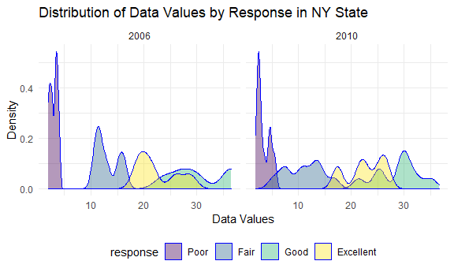

p8105\_hw3\_acm2268
================
Amanda Miles
10/16/2021

\#Question 1

\#\#Reading in data

``` r
library(p8105.datasets)
data("instacart")
```

\#\#Initial Data Exploration

``` r
skimr::skim(instacart)
```

|                                                  |           |
|:-------------------------------------------------|:----------|
| Name                                             | instacart |
| Number of rows                                   | 1384617   |
| Number of columns                                | 15        |
| \_\_\_\_\_\_\_\_\_\_\_\_\_\_\_\_\_\_\_\_\_\_\_   |           |
| Column type frequency:                           |           |
| character                                        | 4         |
| numeric                                          | 11        |
| \_\_\_\_\_\_\_\_\_\_\_\_\_\_\_\_\_\_\_\_\_\_\_\_ |           |
| Group variables                                  | None      |

Data summary

**Variable type: character**

| skim\_variable | n\_missing | complete\_rate | min | max | empty | n\_unique | whitespace |
|:---------------|-----------:|---------------:|----:|----:|------:|----------:|-----------:|
| eval\_set      |          0 |              1 |   5 |   5 |     0 |         1 |          0 |
| product\_name  |          0 |              1 |   3 | 159 |     0 |     39123 |          0 |
| aisle          |          0 |              1 |   3 |  29 |     0 |       134 |          0 |
| department     |          0 |              1 |   4 |  15 |     0 |        21 |          0 |

**Variable type: numeric**

| skim\_variable            | n\_missing | complete\_rate |       mean |        sd |  p0 |    p25 |     p50 |     p75 |    p100 | hist  |
|:--------------------------|-----------:|---------------:|-----------:|----------:|----:|-------:|--------:|--------:|--------:|:------|
| order\_id                 |          0 |              1 | 1706297.62 | 989732.65 |   1 | 843370 | 1701880 | 2568023 | 3421070 | ▇▇▇▇▇ |
| product\_id               |          0 |              1 |   25556.24 |  14121.27 |   1 |  13380 |   25298 |   37940 |   49688 | ▆▆▇▆▇ |
| add\_to\_cart\_order      |          0 |              1 |       8.76 |      7.42 |   1 |      3 |       7 |      12 |      80 | ▇▁▁▁▁ |
| reordered                 |          0 |              1 |       0.60 |      0.49 |   0 |      0 |       1 |       1 |       1 | ▆▁▁▁▇ |
| user\_id                  |          0 |              1 |  103112.78 |  59487.15 |   1 |  51732 |  102933 |  154959 |  206209 | ▇▇▇▇▇ |
| order\_number             |          0 |              1 |      17.09 |     16.61 |   4 |      6 |      11 |      21 |     100 | ▇▂▁▁▁ |
| order\_dow                |          0 |              1 |       2.70 |      2.17 |   0 |      1 |       3 |       5 |       6 | ▇▂▂▂▆ |
| order\_hour\_of\_day      |          0 |              1 |      13.58 |      4.24 |   0 |     10 |      14 |      17 |      23 | ▁▃▇▇▃ |
| days\_since\_prior\_order |          0 |              1 |      17.07 |     10.43 |   0 |      7 |      15 |      30 |      30 | ▅▅▃▂▇ |
| aisle\_id                 |          0 |              1 |      71.30 |     38.10 |   1 |     31 |      83 |     107 |     134 | ▆▃▃▇▆ |
| department\_id            |          0 |              1 |       9.84 |      6.29 |   1 |      4 |       8 |      16 |      21 | ▇▂▂▅▂ |

``` r
str(instacart)
```

    ## tibble [1,384,617 x 15] (S3: tbl_df/tbl/data.frame)
    ##  $ order_id              : int [1:1384617] 1 1 1 1 1 1 1 1 36 36 ...
    ##  $ product_id            : int [1:1384617] 49302 11109 10246 49683 43633 13176 47209 22035 39612 19660 ...
    ##  $ add_to_cart_order     : int [1:1384617] 1 2 3 4 5 6 7 8 1 2 ...
    ##  $ reordered             : int [1:1384617] 1 1 0 0 1 0 0 1 0 1 ...
    ##  $ user_id               : int [1:1384617] 112108 112108 112108 112108 112108 112108 112108 112108 79431 79431 ...
    ##  $ eval_set              : chr [1:1384617] "train" "train" "train" "train" ...
    ##  $ order_number          : int [1:1384617] 4 4 4 4 4 4 4 4 23 23 ...
    ##  $ order_dow             : int [1:1384617] 4 4 4 4 4 4 4 4 6 6 ...
    ##  $ order_hour_of_day     : int [1:1384617] 10 10 10 10 10 10 10 10 18 18 ...
    ##  $ days_since_prior_order: int [1:1384617] 9 9 9 9 9 9 9 9 30 30 ...
    ##  $ product_name          : chr [1:1384617] "Bulgarian Yogurt" "Organic 4% Milk Fat Whole Milk Cottage Cheese" "Organic Celery Hearts" "Cucumber Kirby" ...
    ##  $ aisle_id              : int [1:1384617] 120 108 83 83 95 24 24 21 2 115 ...
    ##  $ department_id         : int [1:1384617] 16 16 4 4 15 4 4 16 16 7 ...
    ##  $ aisle                 : chr [1:1384617] "yogurt" "other creams cheeses" "fresh vegetables" "fresh vegetables" ...
    ##  $ department            : chr [1:1384617] "dairy eggs" "dairy eggs" "produce" "produce" ...
    ##  - attr(*, "spec")=
    ##   .. cols(
    ##   ..   order_id = col_integer(),
    ##   ..   product_id = col_integer(),
    ##   ..   add_to_cart_order = col_integer(),
    ##   ..   reordered = col_integer(),
    ##   ..   user_id = col_integer(),
    ##   ..   eval_set = col_character(),
    ##   ..   order_number = col_integer(),
    ##   ..   order_dow = col_integer(),
    ##   ..   order_hour_of_day = col_integer(),
    ##   ..   days_since_prior_order = col_integer(),
    ##   ..   product_name = col_character(),
    ##   ..   aisle_id = col_integer(),
    ##   ..   department_id = col_integer(),
    ##   ..   aisle = col_character(),
    ##   ..   department = col_character()
    ##   .. )

This dataset is the Instacart Online Grocery Shopping Dataset from 2017
and the file is loaded from p8105.datasets. There are 1384617 rows of
data and 15 variables in the dataset. The specific variables included
are order\_id, product\_id, add\_to\_cart\_order, reordered, user\_id,
eval\_set, order\_number, order\_dow, order\_hour\_of\_day,
days\_since\_prior\_order, product\_name, aisle\_id, department\_id,
aisle, department.

There are 134 aisles and the most items are ordered from aisles 83, 24,
123.

\#\#Plotting the number of items ordered per aisle among aisles with
&gt; 10,000 items ordered

``` r
n_items_df = instacart %>% 
  group_by(aisle, department) %>%
  summarize(n = n()) %>%
  mutate(
    aisle = factor(aisle),
  ) %>%
  filter(n > 10000)
```

    ## `summarise()` has grouped output by 'aisle'. You can override using the `.groups` argument.

``` r
ggplot(n_items_df, aes(x = reorder(aisle, -n), y = n)) + 
  geom_bar(stat = "identity", fill = "lightblue2") +
  theme(axis.text.x = element_text(size = 9, angle = 60, hjust = 1)) +
  labs(x = "Aisle Name", y = "Number Ordered", title = "Number of Items Ordered per Aisle")
```


\#\#Creating Table with the 3 Most Popular Items Ordered from the Baking
Ingredients, Dog Food Care, and Packaged Vegetables Aisles

``` r
pop_items_df = instacart %>%
  filter(aisle == c("baking ingredients", "dog food care", "packaged vegetables fruits")) %>%
  group_by(aisle) %>%
  count(product_name) %>%
  mutate(
    popular_rank = min_rank(desc(n))) %>%
    filter(popular_rank <= 3) %>%
  arrange(aisle, popular_rank)
  
knitr::kable(pop_items_df, 
             digits = 1,
             caption = "*3 Most Popular Items Ordered*")
```

| aisle                      | product\_name                                   |    n | popular\_rank |
|:---------------------------|:------------------------------------------------|-----:|--------------:|
| baking ingredients         | Light Brown Sugar                               |  157 |             1 |
| baking ingredients         | Pure Baking Soda                                |  140 |             2 |
| baking ingredients         | Organic Vanilla Extract                         |  122 |             3 |
| dog food care              | Organix Grain Free Chicken & Vegetable Dog Food |   14 |             1 |
| dog food care              | Organix Chicken & Brown Rice Recipe             |   13 |             2 |
| dog food care              | Original Dry Dog                                |    9 |             3 |
| packaged vegetables fruits | Organic Baby Spinach                            | 3324 |             1 |
| packaged vegetables fruits | Organic Raspberries                             | 1920 |             2 |
| packaged vegetables fruits | Organic Blueberries                             | 1692 |             3 |

*3 Most Popular Items Ordered*

\#\#Table: Mean hour at which Pink Lady Apples and Coffee Ice Cream are
ordered each day of the week

``` r
instacart_hour =
  instacart %>% 
  mutate(
    order_dow = recode(order_dow, `0` = "Sunday", `1` = "Monday", `2` = "Tuesday", `3` = "Wednesday", `4` = "Thursday", `5` = "Friday", `6` = "Saturday")) %>%
  select(product_name, order_dow, order_hour_of_day) %>% 
  filter(product_name %in% c("Pink Lady Apples", "Coffee Ice Cream")) %>%
  group_by(product_name, order_dow) %>%
  summarize(
    mean_hour = mean(order_hour_of_day)) %>%
  pivot_wider(names_from = order_dow, values_from = mean_hour)
```

    ## `summarise()` has grouped output by 'product_name'. You can override using the `.groups` argument.

``` r
knitr::kable(instacart_hour, 
             digits = 1,
             caption = "*Mean Hour Pink Lady Apples and Coffee Ice Cream are Ordered by Day*")
```

| product\_name    | Friday | Monday | Saturday | Sunday | Thursday | Tuesday | Wednesday |
|:-----------------|-------:|-------:|---------:|-------:|---------:|--------:|----------:|
| Coffee Ice Cream |   12.3 |   14.3 |     13.8 |   13.8 |     15.2 |    15.4 |      15.3 |
| Pink Lady Apples |   12.8 |   11.4 |     11.9 |   13.4 |     11.6 |    11.7 |      14.2 |

*Mean Hour Pink Lady Apples and Coffee Ice Cream are Ordered by Day*

\#Question 2: BRFSS

\#\#Load BRFSS data

``` r
library(p8105.datasets)
data("brfss_smart2010") 
```

\#\#Understand BRFSS data

``` r
skimr::skim(brfss_smart2010)
```

|                                                  |                  |
|:-------------------------------------------------|:-----------------|
| Name                                             | brfss\_smart2010 |
| Number of rows                                   | 134203           |
| Number of columns                                | 23               |
| \_\_\_\_\_\_\_\_\_\_\_\_\_\_\_\_\_\_\_\_\_\_\_   |                  |
| Column type frequency:                           |                  |
| character                                        | 17               |
| numeric                                          | 6                |
| \_\_\_\_\_\_\_\_\_\_\_\_\_\_\_\_\_\_\_\_\_\_\_\_ |                  |
| Group variables                                  | None             |

Data summary

**Variable type: character**

| skim\_variable                | n\_missing | complete\_rate | min | max | empty | n\_unique | whitespace |
|:------------------------------|-----------:|---------------:|----:|----:|------:|----------:|-----------:|
| Locationabbr                  |          0 |           1.00 |   2 |   2 |     0 |        51 |          0 |
| Locationdesc                  |          0 |           1.00 |  15 |  33 |     0 |       404 |          0 |
| Class                         |          0 |           1.00 |  11 |  28 |     0 |        16 |          0 |
| Topic                         |          0 |           1.00 |   6 |  22 |     0 |        31 |          0 |
| Question                      |          0 |           1.00 |  27 | 172 |     0 |        40 |          0 |
| Response                      |          0 |           1.00 |   2 |  42 |     0 |        23 |          0 |
| Data\_value\_unit             |          0 |           1.00 |   1 |   1 |     0 |         1 |          0 |
| Data\_value\_type             |          0 |           1.00 |  16 |  16 |     0 |         1 |          0 |
| Data\_Value\_Footnote\_Symbol |     129688 |           0.03 |   1 |   1 |     0 |         1 |          0 |
| Data\_Value\_Footnote         |     129688 |           0.03 | 197 | 197 |     0 |         1 |          0 |
| DataSource                    |          0 |           1.00 |   5 |   5 |     0 |         1 |          0 |
| ClassId                       |          0 |           1.00 |   7 |   7 |     0 |        16 |          0 |
| TopicId                       |          0 |           1.00 |   7 |   7 |     0 |        31 |          0 |
| LocationID                    |     134203 |           0.00 |  NA |  NA |     0 |         0 |          0 |
| QuestionID                    |          0 |           1.00 |   7 |   8 |     0 |        59 |          0 |
| RESPID                        |          0 |           1.00 |   7 |   7 |     0 |        23 |          0 |
| GeoLocation                   |          0 |           1.00 |  20 |  24 |     0 |       404 |          0 |

**Variable type: numeric**

| skim\_variable          | n\_missing | complete\_rate |    mean |     sd |     p0 |    p25 |    p50 |     p75 |   p100 | hist  |
|:------------------------|-----------:|---------------:|--------:|-------:|-------:|-------:|-------:|--------:|-------:|:------|
| Year                    |          0 |           1.00 | 2006.77 |   2.39 | 2002.0 | 2005.0 | 2007.0 | 2009.00 | 2010.0 | ▃▅▃▇▇ |
| Sample\_Size            |          2 |           1.00 |  271.73 | 357.89 |    1.0 |   59.0 |  153.0 |  353.00 | 4505.0 | ▇▁▁▁▁ |
| Data\_value             |       4515 |           0.97 |   43.23 |  32.40 |    0.1 |   14.3 |   33.2 |   77.30 |   99.9 | ▇▅▂▃▅ |
| Confidence\_limit\_Low  |          0 |           1.00 |   37.74 |  32.42 |    0.0 |    8.5 |   25.9 |   71.10 |   99.7 | ▇▃▂▃▃ |
| Confidence\_limit\_High |          0 |           1.00 |   45.76 |  33.29 |    0.0 |   16.3 |   37.0 |   81.55 |  100.0 | ▇▆▃▃▇ |
| Display\_order          |          0 |           1.00 |   32.40 |  18.73 |    1.0 |   16.0 |   32.0 |   48.00 |   68.0 | ▇▇▇▇▆ |

``` r
str(brfss_smart2010)
```

    ## tibble [134,203 x 23] (S3: tbl_df/tbl/data.frame)
    ##  $ Year                      : int [1:134203] 2010 2010 2010 2010 2010 2010 2010 2010 2010 2010 ...
    ##  $ Locationabbr              : chr [1:134203] "AL" "AL" "AL" "AL" ...
    ##  $ Locationdesc              : chr [1:134203] "AL - Jefferson County" "AL - Jefferson County" "AL - Jefferson County" "AL - Jefferson County" ...
    ##  $ Class                     : chr [1:134203] "Health Status" "Health Status" "Health Status" "Health Status" ...
    ##  $ Topic                     : chr [1:134203] "Overall Health" "Overall Health" "Overall Health" "Overall Health" ...
    ##  $ Question                  : chr [1:134203] "How is your general health?" "How is your general health?" "How is your general health?" "How is your general health?" ...
    ##  $ Response                  : chr [1:134203] "Excellent" "Very good" "Good" "Fair" ...
    ##  $ Sample_Size               : int [1:134203] 94 148 208 107 45 450 152 524 77 316 ...
    ##  $ Data_value                : num [1:134203] 18.9 30 33.1 12.5 5.5 82 18 79.3 20.7 74.9 ...
    ##  $ Confidence_limit_Low      : num [1:134203] 14.1 24.9 28.2 9.5 3.5 78.6 14.6 74 15.4 68.6 ...
    ##  $ Confidence_limit_High     : num [1:134203] 23.6 35 38 15.4 7.4 85.3 21.3 84.5 25.9 81.1 ...
    ##  $ Display_order             : int [1:134203] 1 2 3 4 5 6 7 8 9 10 ...
    ##  $ Data_value_unit           : chr [1:134203] "%" "%" "%" "%" ...
    ##  $ Data_value_type           : chr [1:134203] "Crude Prevalence" "Crude Prevalence" "Crude Prevalence" "Crude Prevalence" ...
    ##  $ Data_Value_Footnote_Symbol: chr [1:134203] NA NA NA NA ...
    ##  $ Data_Value_Footnote       : chr [1:134203] NA NA NA NA ...
    ##  $ DataSource                : chr [1:134203] "BRFSS" "BRFSS" "BRFSS" "BRFSS" ...
    ##  $ ClassId                   : chr [1:134203] "CLASS08" "CLASS08" "CLASS08" "CLASS08" ...
    ##  $ TopicId                   : chr [1:134203] "Topic41" "Topic41" "Topic41" "Topic41" ...
    ##  $ LocationID                : chr [1:134203] NA NA NA NA ...
    ##  $ QuestionID                : chr [1:134203] "GENHLTH" "GENHLTH" "GENHLTH" "GENHLTH" ...
    ##  $ RESPID                    : chr [1:134203] "RESP056" "RESP057" "RESP058" "RESP059" ...
    ##  $ GeoLocation               : chr [1:134203] "(33.518601, -86.814688)" "(33.518601, -86.814688)" "(33.518601, -86.814688)" "(33.518601, -86.814688)" ...
    ##  - attr(*, "spec")=
    ##   .. cols(
    ##   ..   Year = col_integer(),
    ##   ..   Locationabbr = col_character(),
    ##   ..   Locationdesc = col_character(),
    ##   ..   Class = col_character(),
    ##   ..   Topic = col_character(),
    ##   ..   Question = col_character(),
    ##   ..   Response = col_character(),
    ##   ..   Sample_Size = col_integer(),
    ##   ..   Data_value = col_double(),
    ##   ..   Confidence_limit_Low = col_double(),
    ##   ..   Confidence_limit_High = col_double(),
    ##   ..   Display_order = col_integer(),
    ##   ..   Data_value_unit = col_character(),
    ##   ..   Data_value_type = col_character(),
    ##   ..   Data_Value_Footnote_Symbol = col_character(),
    ##   ..   Data_Value_Footnote = col_character(),
    ##   ..   DataSource = col_character(),
    ##   ..   ClassId = col_character(),
    ##   ..   TopicId = col_character(),
    ##   ..   LocationID = col_character(),
    ##   ..   QuestionID = col_character(),
    ##   ..   RESPID = col_character(),
    ##   ..   GeoLocation = col_character()
    ##   .. )

\#\#Clean BRFSS data

``` r
brfss_df = select(brfss_smart2010, year = Year, state_abbr = Locationabbr, location_desc = Locationdesc, topic = Topic, response = Response, data_value = Data_value, data_type = Data_value_type, data_unit = Data_value_unit ) %>%
  filter(topic == "Overall Health" & response %in% c("Excellent", "Good", "Fair", "Poor")) %>%
  mutate(
    response = factor(response),
    response = forcats::fct_relevel(response, c("Poor", "Fair", "Good", "Excellent"))
  ) 
```

\#\#BRFSS exploratory data analysis

\#\#\#Exploratory analysis of states and the number of locations
observed in 2002 and 2010

``` r
brfss_02_df = brfss_df %>%
 filter(year == 2002) %>%
  group_by(state_abbr) %>%
  summarize(n_locations = n_distinct(location_desc)) %>%
  filter(n_locations > 6)

knitr::kable(brfss_02_df, 
             digits = 1,
             caption = "*The Number of Locations for States Observed at > 6 Locations in 2002*")
```

| state\_abbr | n\_locations |
|:------------|-------------:|
| CT          |            7 |
| FL          |            7 |
| MA          |            8 |
| NC          |            7 |
| NJ          |            8 |
| PA          |           10 |

*The Number of Locations for States Observed at &gt; 6 Locations in
2002*

``` r
brfss_10_df = 
  brfss_df %>%
 filter(year == 2010) %>%
  group_by(state_abbr) %>%
  summarize(n_locations = n_distinct(location_desc)) %>%
  filter(n_locations > 6)

knitr::kable(brfss_10_df, 
             digits = 1,
             caption = "*The Number of Locations for States Observed at > 6 Locations in 2010*")
```

| state\_abbr | n\_locations |
|:------------|-------------:|
| CA          |           12 |
| CO          |            7 |
| FL          |           41 |
| MA          |            9 |
| MD          |           12 |
| NC          |           12 |
| NE          |           10 |
| NJ          |           19 |
| NY          |            9 |
| OH          |            8 |
| PA          |            7 |
| SC          |            7 |
| TX          |           16 |
| WA          |           10 |

*The Number of Locations for States Observed at &gt; 6 Locations in
2010*

In 2002, the states Connecticut, Florida, Massachusetts, North Carolina,
New Jersey, and Pennsylvania were observed at 7 or more locations. In
2010, the states California, Colorado, Florida, Massachusetts, Maryland,
North Carolina, Nebraska, New Jersey, New York, Ohio, Pennsylvania,
South Carolina, Texas, and Washington were observed at 7 or more
locations.

\#\#\#Exploratory analysis of “excellent” responses

``` r
excellent_df = select(brfss_df, year, state_abbr, data_value, location_desc, response) %>%
  filter(response == "Excellent") %>%
  group_by(year, state_abbr) %>%
  mutate(avg_value = mean(data_value, na.rm = TRUE)) %>%
  select(-data_value) 

ggplot(data = excellent_df, aes(x = year, y = avg_value, color = state_abbr)) +
  geom_line(data = excellent_df) + 
  theme(
    plot.title = element_text(size = 11),
    axis.title.x = element_text(size = 9),
    axis.title.y = element_text(size = 9),
    legend.position = "right") +
  labs(x = "Year", y = "Average Data Value", title = "Average Data Value of Excellent Responses by State")
```


\#\#\#Exploratory analysis of the distribution of data value responses
among locations in NY State FOR 2006 and 2010

``` r
ny_df = select(brfss_df, year, state_abbr, location_desc, response, data_value) %>%
  filter(year %in% c(2006, 2010) & state_abbr == "NY") %>%
  group_by(year, response)

ggplot(ny_df, aes(x = data_value, fill = response)) + 
  geom_density(alpha = .4, adjust = .5, color = "blue") +
  facet_grid(. ~ year) +
  labs(x = "Data Values", y = "Density", title = "Distribution of Data Values by Response in NY State")
```



\#Question 3: Accelerometer

\#\#Load, clean, and tidy the accelerometer data

``` r
accel_df = read_csv(file = "./data/accel_data.csv") %>%
  janitor::clean_names()
```

    ## Rows: 35 Columns: 1443

    ## -- Column specification --------------------------------------------------------
    ## Delimiter: ","
    ## chr    (1): day
    ## dbl (1442): week, day_id, activity.1, activity.2, activity.3, activity.4, ac...

    ## 
    ## i Use `spec()` to retrieve the full column specification for this data.
    ## i Specify the column types or set `show_col_types = FALSE` to quiet this message.

``` r
accel_cleaned = accel_df %>%
  mutate(
    type_of_day = ifelse(day %in% c("Monday", "Tuesday", "Wednesday", "Thursday", "Friday"), "weekday", 
                         ifelse(day %in% c("Saturday", "Sunday"), "weekend", ""))
    ) %>%
  relocate(week, type_of_day) %>%
  pivot_longer(
    cols = activity_1:activity_1440, 
    names_to = "activity_number",
    names_prefix = "activity_",
    values_to = "activity_count") %>%
  mutate(
    activity_number = as.numeric(activity_number)
  )

view(accel_cleaned)
```

\#\#Aggregate across minutes to create a total activity variable

``` r
accel_tot_act = accel_cleaned %>% 
  group_by(day_id) %>%
  summarize(total_activity = sum(activity_count))

knitr::kable(accel_tot_act, 
             digits = 2,
             caption = "*Total Accelerometer Activity per Day Observed*")
```

| day\_id | total\_activity |
|--------:|----------------:|
|       1 |       480542.62 |
|       2 |        78828.07 |
|       3 |       376254.00 |
|       4 |       631105.00 |
|       5 |       355923.64 |
|       6 |       307094.24 |
|       7 |       340115.01 |
|       8 |       568839.00 |
|       9 |       295431.00 |
|      10 |       607175.00 |
|      11 |       422018.00 |
|      12 |       474048.00 |
|      13 |       423245.00 |
|      14 |       440962.00 |
|      15 |       467420.00 |
|      16 |       685910.00 |
|      17 |       382928.00 |
|      18 |       467052.00 |
|      19 |       371230.00 |
|      20 |       381507.00 |
|      21 |       468869.00 |
|      22 |       154049.00 |
|      23 |       409450.00 |
|      24 |         1440.00 |
|      25 |       260617.00 |
|      26 |       340291.00 |
|      27 |       319568.00 |
|      28 |       434460.00 |
|      29 |       620860.00 |
|      30 |       389080.00 |
|      31 |         1440.00 |
|      32 |       138421.00 |
|      33 |       549658.00 |
|      34 |       367824.00 |
|      35 |       445366.00 |

*Total Accelerometer Activity per Day Observed*

\#\#Create a plot that shows the 24-hour activity time courses for each
day

``` r
accel_cleaned %>%
  group_by(day, activity_number) %>%
  ggplot(aes(x = activity_number, 
             y = activity_count, 
             color = day)) +
  geom_smooth(se = FALSE) + 
  theme(legend.position = "right") +
  labs(x = "Minutes", y = "Activity Counts", title = "24-hour Activity by Minute per Day")
```

    ## `geom_smooth()` using method = 'gam' and formula 'y ~ s(x, bs = "cs")'


